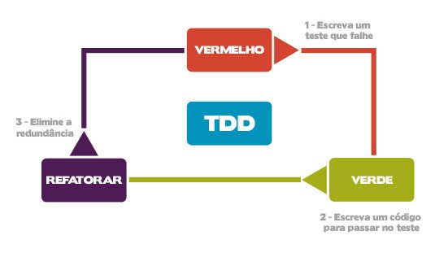

Salve galera, tudo tranquilo? Esse é meu segundo artigo, e gostaria de compartilhar algo que vem me ajudando muito durante o desenvolvimento de software e na minha própria evolução profissional.

Estou falando sobre os **testes unitários**. Acredito que todo mundo concorda que um código sem testes, é um código instável e frágil à mudanças. É muito ruim programar no escuro, nós nunca temos certeza que o que estamos desenvolvendo irá funcionar em produção, sem conflitar com as features já existentes.

Por outro lado, escrever testes para uma feature já implementada pode ser algo muito doloroso, por isso **muita gente prefere correr o risco e deixar o código sem cobertura.**

<!--truncate-->

Mas recentemente venho estudando fortemente uma metodologia que abriu minha mente, o **TDD**, ou em português **"Desenvolvimento guiado por testes"**. No TDD nós criamos o teste primeiro, e só depois criamos a implementação de fato, que fará o teste passar. Isso faz com que nosso código sempre esteja coberto por testes.

## Traduzindo

Se eu quisesse criar uma função que me retornasse o maior número de uma lista em Javascript, utilizando o **TDD** (escrevendo o teste primeiro), eu começaria fazendo algo mais ou menos assim:

```js
// Arquivo: pegueOMaiorNumero.test.js
// Sintaxe de um framework de testes do Javascript

describe("pegueOMaiorNumero", () => {
  test("deve retornar o maior número de uma lista", () => {
    const maiorNumero = pegueOMaiorNumero([1, 9, 7, 15, 21, 10]);
    expect(maiorNumero).toBe(21);
  });
});
```

Nesse caso, eu forneci uma lista com alguns números, onde o 21 é o maior deles. Mas note que em nenhum momento foi criada a função **pegueOMaiorNumero**. Estou invocando uma função que **ainda não foi criada**, e ainda estou esperando que o resultado seja 21. Nesse caso o teste irá falhar.

É ai que a brincadeira começa. Quando o teste falha, é sinal de que precisamos implementar a feature que faça esse teste passar.

## Então vamos lá!

Vou criar a função que fará o teste passar:

```js
// Arquivo: pegueOMaiorNumero.test.js

const pegueOMaiorNumero = (numeros) => {
  let maior = 0;

  for (let i = 0; i < numeros.length; i++) {
    if (numeros[i] > maior) {
      maior = numeros[i];
    }
  }

  return maior;
};

describe("pegueOMaiorNumero", () => {
  test("deve retornar o maior número de uma lista", () => {
    const maiorNumero = pegueOMaiorNumero([1, 9, 7, 15, 21, 10]);
    expect(maiorNumero).toBe(21);
  });
});
```

Agora o teste começará a passar. Veja que o algoritmo não ficou dos melhores, mas conseguiu satisfazer o que o teste pediu. Agora que o teste está passando, posso refatorar a função **pegueOMaiorNumero** sem medo, pois ela está coberta por um teste. Caso a função passe a retornar uma string, null, ou um número que não seja o maior, **o teste irá me avisar, reprovando**.

## Vamos refatorar, sem medo!

```js
// Arquivo: pegueOMaiorNumero.test.js

const pegueOMaiorNumero = (numeros) => {
  return Math.max(...numeros);
};

describe("pegueOMaiorNumero", () => {
  test("deve retornar o maior número de uma lista", () => {
    const maiorNumero = pegueOMaiorNumero([1, 9, 7, 15, 21, 10]);
    expect(maiorNumero).toBe(21);
  });
});
```

Pronto, se a gente rodar esse teste, ele irá continuar passando, pois o **Math.max** está fazendo o mesmo que o **laço de repetição** estava fazendo anteriormente, mas de uma maneira mais enxuta. O fato é que, temos confiança de alterar um código que nos fale se a nossa regra de negócios falhou. **É inadmissível** que nossa função **pegueOMariorNumero** retorne um número que não é o maior.

## Conclusão

Nossa simples feature de retornar o maior número, **esteve durante todo o tempo de desenvolvimento coberta por um teste**. Se a gente fizesse a feature primeiro ao invés do teste, teríamos que testá-la manualmente a cada alteração, printando o resultado no console, até de fato escrever um teste pra ela. Isso seria **cansativo**. O teste é automatizado, ou seja, escrevemos uma única vez, e ele sempre irá assegurar o resultado pra gente.

Escolhi esse exemplo de algoritmo, pois há várias formas de implementá-lo. Caso você descubra alguma forma mais enxuta que essa apresentada, poderá implementar sem correr o risco de quebrar sua aplicação.

Como material complementar, recomendo essa live que aconteceu no dia 09/12/2021, e que considero excepcional por **dois motivos: não tem enrolação, e os caras sabem o que estão ensinando.** Por hoje é isso, forte abraço e até a próxima!

[](https://youtu.be/sg1zFpNM5Jw)

- Repositório código fonte: [https://github.com/mrbrunelli/tdd-pega-o-maior-numero](https://github.com/mrbrunelli/tdd-pega-o-maior-numero)
