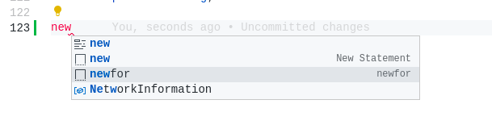

Salve galera, tudo bem?

Hoje quero compartilhar com vocês algo bem bacana, que é criar seus próprios snippets no VS Code.

## O que é um Snippet?

<!-- truncate -->

### Um atalho

Nada mais é que um atalho para a criação de um trecho de código. Pense em um código simples como esse:

```js title="Lógica de um loop no Javascript"
for (const item of items) {
  console.log(item);
}
```

Esse tipo de código tende a se repetir muito durante nosso desenvolvimento rotineiro. Com isso, pode ficar chato escrever a mesma sintaxe toda vez.

### Produtividade

É ai que a mágica acontece! Que tal digitiar apenas `newfor` e o VS Code criá-lo para você? Sim é possível!

## Vamos começar

### Primeiro passo

Vamos criar o arquivo principal para nossos snippets.

Com seu VS Code aberto, digite <kbd>Ctrl</kbd>+<kbd>Shift</kbd>+<kbd>P</kbd> e digite **snippets** na barra que apareceu, selecione a opção **Preferences: Configure User Snippets** e depois **New Global Snippet File**.

Abrirá uma caixinha para você digitar o nome do seu arquivo de snippets. Você pode colocar qualquer nome, eu vou colocar **my-snippets**.

### Segundo passo

Vai abrir um arquivo mais ou menos assim:

```json title="my-snippets.code-snippets"
{
  // Place your global snippets here. Each snippet is defined under a snippet name and has a scope, prefix, body and
  // description. Add comma separated ids of the languages where the snippet is applicable in the scope field. If scope
  // is left empty or omitted, the snippet gets applied to all languages. The prefix is what is
  // used to trigger the snippet and the body will be expanded and inserted. Possible variables are:
  // $1, $2 for tab stops, $0 for the final cursor position, and ${1:label}, ${2:another} for placeholders.
  // Placeholders with the same ids are connected.
  // Example:
  // "Print to console": {
  // 	"scope": "javascript,typescript",
  // 	"prefix": "log",
  // 	"body": [
  // 		"console.log('$1');",
  // 		"$2"
  // 	],
  // 	"description": "Log output to console"
  // }
}
```

Apague tudo e monte essa estrutura:

```json title="my-snippets.code-snippets"
{
  "newfor": {
    "scope": "",
    "prefix": "",
    "body": [],
    "description": ""
  }
}
```

#### Significado de cada atributo

- **newfor**: é o nome do nosso snippet
- **scope**: em quais tipos de arquivos seu snippet executará
- **prefix**: atalho para seu snippet
- **body**: linhas que seu snippet irá gerar
- **description**: descrição do que seu snippet irá gerar (não obrigatório)

### Terceiro passo

Agora que sabemos o que cada campo significa, vamos preenche-los com nosso código:

```json title="my-snippets.code-snippets"
{
  "newfor": {
    "scope": "javascript, typescript",
    "prefix": "newfor",
    "body": ["for (const item of items) {", "console.log(item)", "}"],
    "description": "cria um loop com for"
  }
}
```

### Quarto passo

Pronto, salve o seu arquivo de snippet, vá para um arquivo **.js** ou **.ts** e faça o teste. Digite `newfor` e aperte <kbd>Ctrl</kbd>+ <kbd>Space bar</kbd>.

Deverá aparecer o nome do seu snippet no autocomplete, dessa forma:


Só apertar <kbd>Enter</kbd> que seu código será gerado. Legal né?

## Conclusão

Caso você tenha chegado até aqui e não tenha funcionado, volte desde o começo e tente novamente com calma, você deve ter deixado algo passar. É bem simples.

Espero que tenha gostado! Se foi útil para você, compartilhe com seus amigos e colegas de trabalho!

Até a próxima!
