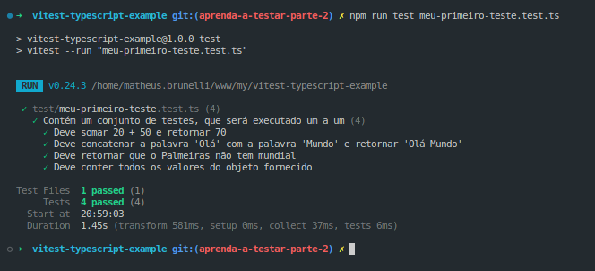
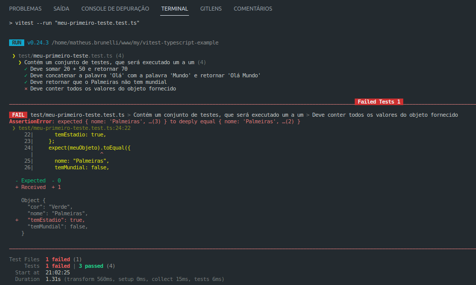

Como configurar e utilizar um framework de testes no Node utilizando Typescript? Temos várias opções excelentes para isso, e por esse motivo irei escolher a mais fácil para o cenário de Node + Typescript.

<!-- truncate -->

## Como escolher um framework de testes?

Primeiro devo avaliar quais os cenários quero testar, se é frontend ou backend, e se vou utilizar Javascript ou Typescript.

Vou utilizar Node + Typescript nos exemplos, e isso faz a minha lista ficar restrita a alguns nomes:

- [Jest](https://jestjs.io/pt-BR/)
- [Mocha](https://mochajs.org/)
- [Vitest](https://vitest.dev/)

> Jest e Mocha necessitam de um parser de Typescript para executar, como o ts-jest ou ts-node, o que pode complicar para quem está começando, já que o arquivo de configuração fica muito complexo nesses cenários.

Não quero abrir mão do Typescript e nem da facilidade de configuração, então irei escolher o Vitest. Na página inicial do Vitest contém o [Get Started](https://vitest.dev/guide/) contendo alguns exemplos de instalação e configuração.

## Configurando o projeto

### Setup Node + Typescript

Vou criar uma pasta vazia, com um nome qualquer.

```sh
mkdir vitest-typescript-example
```

Com o meu Visual Studio Code aberto nessa pasta, vou abrir um terminal integrado e iniciar o Node, e instalar as dependências básicas para o Typescript funcionar.

```sh
npm init -y

npm install -D typescript @types/node
```

Agora vou criar o tsconfig.json, que é o arquivo de configuração do Typescript. Ele irá gerar uma configuração default, e vou manter ela.

```sh
npx tsc --init
```

Pronto, meu projeto já está configurado com Node + Typescript.

### Setup Vitest

Agora vou instalar o Vitest como dependência de desenvolvimento.

```sh
npm install -D vitest
```

O Vitest precisa de um arquivo de configuração para poder executar. Na própria documentação tem um exemplo simples. Vou criar um arquivo **vitest.config.ts** na raiz, e adicionar a configuração básica.

```ts title="vitest.config.ts"
import { defineConfig } from "vitest/config";

export default defineConfig({
  test: {
    reporters: "verbose",
  },
});
```

Veja como o arquivo de configuração é enxuto, bem diferente dos outros frameworks citados no começo do post. [Na documentação tenho acesso a API](https://vitest.dev/config/), e como posso personalizar o **defineConfig()**. Não vou configurar nada extra, já está ótimo como está.

> Veja que configurei **reporters** como **verbose**, isso para que eu possa obter todas as informações do teste no terminal.

### Configurando o package.json

Quando eu executei o **npm init -y**, foi gerado um arquivo **package.json** na raiz, com algumas configurações bem simples. Dentro de **scripts** tem um script **test**. Vou editá-lo.

```json title="package.json"
...
"scripts": {
    "test": "vitest --run"
}
...
```

> Agora quando eu executar `npm run test` no terminal, o vitest irá executar meus testes. Como não temos nenhum teste no momento, ele tentará rodar e retornará um erro dizendo que nenhum teste foi encontrado.

## Escrevendo o primeiro teste

Vou criar uma pasta **test** na raiz, e criar um arquivo chamado **primeiro-teste.test.ts** dentro dela. Em seguida irei adicionar alguns cenários.

> É importante respeitar a extensão **.test.ts**, pois o Vitest procura por essa extensão durante a execução.

```ts title="primeiro-teste.test.ts"
import { describe, test, expect } from "vitest";

describe("Contém um conjunto de testes, que será executado um a um", () => {
  test("Deve somar 20 + 50 e retornar 70", () => {
    expect(20 + 50).toBe(70);
  });

  test("Deve concatenar a palavra 'Olá' com a palavra 'Mundo' e retornar 'Olá Mundo'", () => {
    expect("Olá " + "Mundo").toBe("Olá Mundo");
  });

  test("Deve retornar que o Palmeiras não tem mundial", () => {
    const temMundial = false;
    expect(temMundial).toBeFalsy();
  });

  test("Deve conter todos os valores do objeto fornecido", () => {
    const meuObjeto = {
      nome: "Palmeiras",
      temMundial: false,
      cor: "Verde",
    };
    expect(meuObjeto).toEqual({
      nome: "Palmeiras",
      temMundial: false,
      cor: "Verde",
    });
  });
});
```

Agora vou abrir o terminal e executar `npm run test`, e o Vitest irá executar e retornar todos esses cenários no terminal, verde caso tenha passado, e vermelho caso tenha reprovado algum.

### Sucesso



### Erro

Adicionei um campo a mais no objeto do último teste, **porém não adicionei no expect**, logo o teste fez a comparação e reprovou, pois os objetos não são mais iguais.

> Veja como a inteface é amigável, ela exibe com muita clareza qual teste reprovou e o motivo.



## Resumo

- Preciso saber em qual cenário vou escrever meus testes, se é frontend ou backend, pois cada um possuí a ferramenta certa para o cenário.
- Se eu ainda não sei testar, devo procurar o framework mais fácil para aprender. Nesse caso foi o Vitest, pois ele tem uma filosofia **less config**.
- A documentação contém tudo que preciso para configurar o framework, e ainda contém vários exemplos.
- O Vitest procura por arquivos que tenham a extensão **.test.ts**.
- Os resultados dos testes são exibidos no terminal, de uma forma muito amigável.
- Posso executar o comando `npm run test` quantas vezes quiser, e o teste executará em milésimos de segundos.
- Automatizar é bem melhor que testar manualmente.

### Repositório com o código

[https://github.com/mrbrunelli/vitest-typescript-example/tree/aprenda-a-testar-parte-2](https://github.com/mrbrunelli/vitest-typescript-example/tree/aprenda-a-testar-parte-2)
